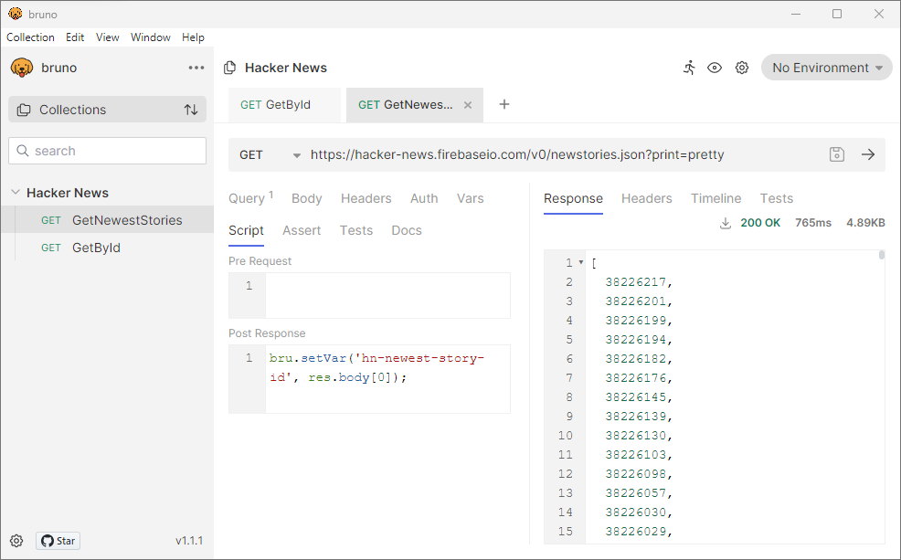
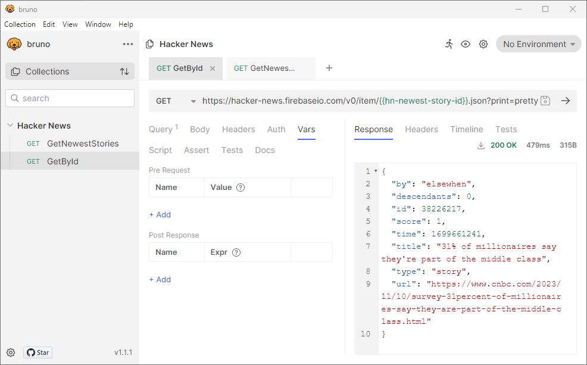

# Bruno (Postman Alternative) - Share a variable across requests
*2023/11/11 - Coenraad Stijne*  

#### Summary

[Bruno](https://www.usebruno.com/) describes itself as:

>Bruno is a Fast and Git-Friendly Opensource API client, aimed at revolutionizing the status quo represented by Postman, Insomnia and similar tools out there.

#### Reuse a variable across requests:

For example, let's create a request which fetches the newest stories from [Hacker News](https://news.ycombinator.com/).

##  GetNewestStories Request



By running a `Post Response` script, we can set a variable which is available to all requests in the same collection:

#### Post Response Script:

`bru.setVar('hn-newest-story-id', res.body[0]);`

#### Output:

`hn-newest-story-id == 38226217`

## GetByID Request



<!--  -->
By using `{{hn-newest-story-id}}` in the URL, it gets automatically substituted with our variable content: `38226217`.
<!--  -->

If we want to assert our variable has been set correctly, the following could be added to `GetById => Script => Pre Request`:

```
if (!bru.getVar('hn-newest-story-id'))
    throw "hn-newest-story-id is not defined. Run GetNewestStories request first."
```

---

#### GetNewestStories.bru

```
meta {
  name: GetNewestStories
  type: http
  seq: 1
}

get {
  url: https://hacker-news.firebaseio.com/v0/newstories.json?print=pretty
  body: none
  auth: none
}

query {
  print: pretty
}

script:post-response {
  bru.setVar('hn-newest-story-id', res.body[0]);
}
```

#### GetById.bru

<!--  -->
```
meta {
  name: GetById
  type: http
  seq: 2
}

get {
  url: https://hacker-news.firebaseio.com/v0/item/{{hn-newest-story-id}}.json?print=pretty
  body: none
  auth: none
}

query {
  print: pretty
}

script:pre-request {
  if (!bru.getVar('hn-newest-story-id'))
      throw "hn-newest-story-id is not defined. Run GetNewestStories request first."
}
```
<!--  -->